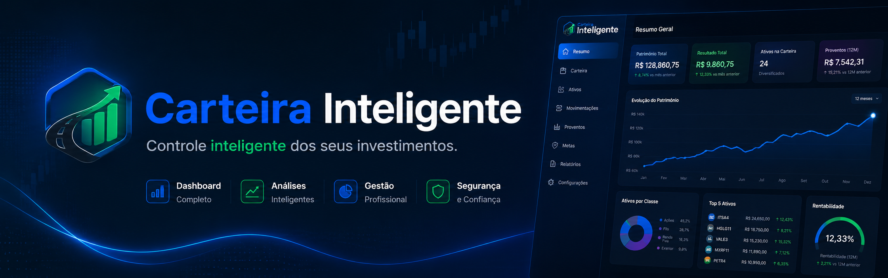

<p align="center">
  <a href="https://marcelogomesdev.github.io/KMLucrativo-2.0/" target="_blank">
    🚀 Acessar o KM Lucrativo 2.0
  </a>
</p>

# KM Lucrativo

Dashboard financeiro para motoristas de aplicativo acompanharem receitas, despesas, quilômetros rodados, horas trabalhadas, consumo, metas e lucratividade. A aplicação funciona diretamente no navegador, mantém os dados localmente e não exige backend.

## Funcionalidades

- Visão Geral com indicadores financeiros e operacionais.
- Filtros por hoje, ontem, semana, mês, ano, período personalizado e aplicativo.
- Receita bruta, lucro líquido, despesas, quilômetros, horas, consumo e margem.
- Receita e lucro por hora e por quilômetro.
- Sete gráficos responsivos com Chart.js.
- Análise inteligente com rankings, médias, comparações e recomendações automáticas.
- Metas semanais, mensais e anuais com acompanhamento visual de progresso.
- Calculadora completa de custos fixos e variáveis do veículo.
- Simulador de corrida com diagnóstico de rentabilidade.
- Registro Diário com cadastro, edição e exclusão.
- Persistência de registros, metas, configurações e tema com LocalStorage.
- Backup completo e restauração em JSON.
- Relatório financeiro exportável em PDF.
- Tema claro e escuro persistente com identidade visual adaptativa.
- Navegação acessível por teclado e layout responsivo.

## Tecnologias

- HTML5 semântico
- CSS3 responsivo
- JavaScript modular
- LocalStorage
- Chart.js 4.4.7
- html2canvas 1.4.1
- jsPDF 2.5.1
- Font Awesome 6.5.2

## Capturas de tela

As capturas atualizadas do dashboard podem ser armazenadas em `assets/screenshots/` para publicação no portfólio e no GitHub.

## Como executar

O projeto pode ser aberto diretamente pelo arquivo `index.html`.

Para desenvolvimento local com servidor HTTP:

```bash
python -m http.server 8000
```

Depois, acesse `http://localhost:8000`.

Após alterar qualquer módulo em `js/`, regenere o bundle de produção:

```bash
node tools/build-bundle.mjs
```

## Estrutura do projeto

```text
KM Lucrativo/
├── assets/
│   └── screenshots/          # Capturas para documentação
├── css/
│   ├── base.css              # Tokens, reset e estilos globais
│   ├── layout.css            # Cabeçalho, conteúdo e rodapé
│   ├── components.css        # Campos, botões e cartões
│   ├── dashboard.css         # Dashboard, filtros, metas e gráficos
│   ├── intelligence.css      # Análises e recomendações
│   ├── records.css           # Navegação e Registro Diário
│   ├── pdf.css               # Relatório exportável
│   └── responsive.css        # Breakpoints da interface
├── docs/                     # Documentação técnica
├── images/                   # Identidade visual oficial
├── js/                       # Módulos JavaScript
├── tools/                    # Geração do bundle clássico
├── index.html                # Estrutura da aplicação
├── script.js                 # Bundle de produção
└── style.css                 # Entrada CSS de compatibilidade
```

## Roadmap

- [x] Dashboard financeiro e indicadores operacionais.
- [x] Registro Diário persistente.
- [x] Relatórios e gráficos interativos.
- [x] Inteligência financeira e recomendações.
- [x] Metas, filtros avançados e backup.
- [x] Identidade visual oficial com suporte aos temas claro e escuro.
- [ ] Evoluções futuras serão definidas após a estabilização da versão 2.1.0.

## Dados e privacidade

Todos os dados são armazenados exclusivamente no LocalStorage do navegador. Nenhuma informação financeira é enviada para servidores externos.

## Documentação

- [Arquitetura](docs/ARCHITECTURE.md)
- [Módulos JavaScript](docs/MODULES.md)

## Autor

Desenvolvido por **Marcelo Gomes Dev**.

- [GitHub](https://github.com/marcelogomesdev)
- [LinkedIn](https://www.linkedin.com/in/marcelogomesdev/)

## Licença

Projeto disponibilizado para fins de estudo, portfólio e evolução profissional.
